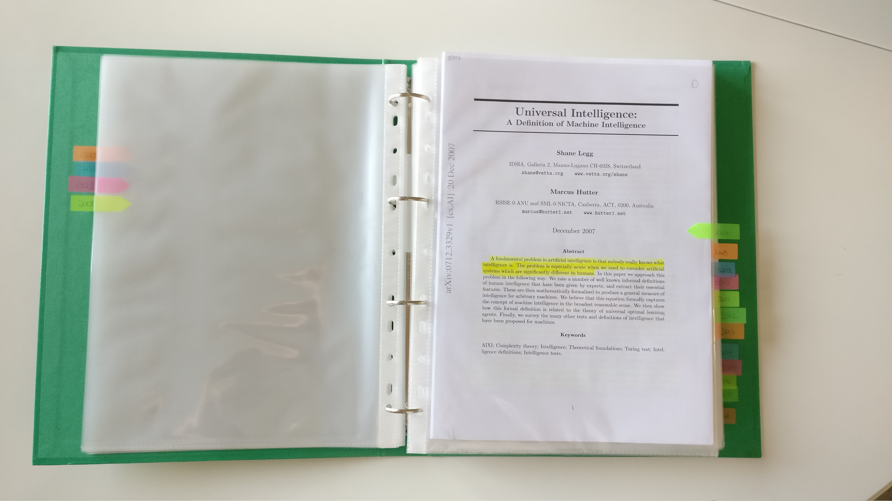
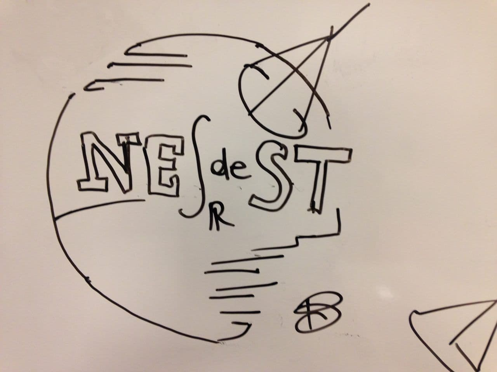

# One Project Per Year (OPPY)

OPPY is my meta-project started in 2014: **every year I try to complete at least one personal project to add some value to my life.**

Projects can be of different kinds: technical side projects, personal challenges, good habits. 
I firmly believe that engaging in these projects has a positive impact on my life and makes me a better scientist, a better friend and, overall, a better person.

Further details can be found in the lightning-talk I gave for [Speck&Tech](http://speckand.tech/) in Trento.
It was my first public speech, do not be too severe with me.
Here you can find [the presentation](README/Speck%26Tech%20presentation%20-%20OPPY:%20on%20the%20importance%20of%20personal%20projects.pdf), [my notes](README/Speck%26Tech%20notes%20-%20OPPY:%20on%20the%20importance%20of%20personal%20projects.txt) and [the video](https://www.youtube.com/watch?v=AseZbBq5qhA) (12:38).

*Sharing is caring.*
In this repository you can find further details about my annual projects.
Some of them are still ongoing!

I sincerely hope OPPY could **inspire you to follow your passions and your dreams**.

---
Table of Contents
=================
* :roller_coaster: [GPerks - 2021, March](#roller_coaster-gperks---2021-march-ongoing)
* :checkered_flag: [Stay Connected - 2021, March](#checkered_flag-stay-connected---2021-march-completed)
* :roller_coaster: [Paperplanes - 2020, March](#roller_coaster-paperplanes---2020-march-ongoing)
* :checkered_flag: [Amsterdam Pauper Series - 2019, February](#checkered_flag-amsterdam-pauper-series---2019-february-completed)
* :roller_coaster: [One Song Per Artist - 2018, October](#roller_coaster-one-song-per-artist---2018-october-ongoing)
* :roller_coaster: [Asimov - 2018, April](#roller_coaster-asimov---2018-april-ongoing)
* :checkered_flag: [Elric - 2017, January](#checkered_flag-elric---2017-january-completed)
* :checkered_flag: [NErdeST - 2016, April](#checkered_flag-nerdest---2016-april-completed)
* :roller_coaster: [#dayoff - 2016, January](#roller_coaster-dayoff---2016-january-ongoing)
* :checkered_flag: [#50weeksofTED - 2015, October](#checkered_flag-50weeksofted---2015-october-completed)
* :roller_coaster: [Computer Scientists - 2015, October](#roller_coaster-computer-scientists-floppy_disk---2015-october-ongoing)
* :checkered_flag: [Xantudd's Kennel - 2014, June](#checkered_flag-xantudds-kennel---2014-june-completed)

---
## :roller_coaster: GPerks - *2021, March* (ongoing)

Please wait the end of the year...

---
## :checkered_flag: Stay Connected - *2021, March* (completed)

Please wait the end of the year...

---
## :roller_coaster: Paperplanes - *2020, March* (ongoing)

On March 28, as an attempt to fight the storm of bad news related to the beginning of the COVID-19 pandemic, I launched Paperplanes with 4 friends of mine.

Paperplanes are flying questions taking off from inspiring, latent, beautiful contents and blown by the wind.

Since June 20, we share 2 posts per week (on Wednesday and on Saturday). You can follow us on [Telegram](https://t.me/via_paperplanes) and on [Twitter](https://twitter.com/via_paperplanes).

In a world where everyone believes to know all the answers, we try to ask good questions instead.

---
## :checkered_flag: Amsterdam Pauper Series - *2019, February* (completed)

[Pauper](https://magic.wizards.com/en/game-info/gameplay/formats/pauper) is my favourite [Magic: The Gathering](http://magic.wizards.com/) format, because it's fun, cheap and strategic.
I learnt how to play Magic in 2016, and I realized this game is so popular that players can be found everywhere.

When I moved to Amsterdam in 2019, playing Pauper offered me the chance to meet new people that soon became good friends.
I immediately joined the local community, and I pleasantly discovered that a series of tournament was going to be organized over the course of the year.

During 2019, I decided to focus on Pauper and to become a better player.
I tried to master existing archetypes and to brew new decks, with the intention to become #1 in the ranking and to qualify for the final event reserved to the top8.

At the end of 2019, I didn't win any of the 5 tournaments, and my best result was a 3rd place.
However, I managed to consistently get good results by playing my favourite decks, despite them not generally being among the best performing ones.
In the end, I managed [to achieve my goal](https://docs.google.com/spreadsheets/d/e/2PACX-1vQ1wKzjICbDIuzmqw9NDI6G7SR1cgVtaz7FT_Xq26hiGt7fzDMbm79mHVqR4w4I4Dt8f5UrDmD3fuje/pubhtml?gid=0&single=true) and to qualify as #1 for the final event (which I also lost).

I loved my Pauper journey, both for the steps I took alone and for those shared with the community.

Alone, I collected and organized Pauper deck lists on [deckstats](https://deckstats.net/decks/78813/) and proudly completed my battlebox.

With the community, we tried to organize friendly and inclusive tournaments, trying to bring new players also from other cities.
Lending decks, collecting stats, and spending some Sundays together was my favourite routine and one of the best thing of my 2019. 

*Update (2020, February)*: Just before the COVID-19 pandemic, I represented with my friend Alessandro the Netherlands during [Paupergeddon 2020](http://pauperwave.altervista.org/paupergeddon-milano-2020-top8-metagame/) in Milan, one of the biggest Pauper event in Italy and in the world. The matches with the Russian guys were legendary, and this experience was the icing on the cake.

---
## :roller_coaster: One Song Per Artist - *2018, October* (ongoing)

I don't listen to music a lot and, in general, I don't consider it as a fundamental part of my life.
Despite all of this, I am very open to new genres and recommendations.
For this reason, I like to define myself as a free listener.
However, my friend Lorenzo would tell you I am simply disordered.

Inspired by the rich variety of [Reddit Beautiful Songs Playlist](https://open.spotify.com/playlist/0sz25A0UqAfcQdso97w3kA?si=57dce4e7346e4547) and constrained by Spotify's free number of skips, **I created a Spotify playlist with my favourite song of some artists***.

My [One Song Per Artist](https://open.spotify.com/playlist/2xFBe1fS6Lxr20XGleP1f1?si=32fc926961594741) playlist has proved to be a surprisingly fun decision-making exercise, an inclusive party soundtrack and a smart tool to avoid a Spotify premium account.

In the [project folder](One%20Song%20Per%20Artist) you can find additional material and plots.

(*) *artist* is intended as in the complete Spotify entry, so a featuring won't be considered for the uniqueness criterion.
In other words, I may have:
* *song1* by **X**
* *song2* by **Y**
* *song3* by **X, Y**

but not also:
* *song4* by **X** (conflicts with *song1*)
* *song5* by **X, Y** (conflicts with *song3*)

*Update (2020, July)*: I started an instrumental spin-off of the project at [One Song Per Artist - Instrumental](https://open.spotify.com/playlist/2AKId0drAP12ZyuPncCq1j?si=87d86c1cd8374ee1).

---
## :roller_coaster: Asimov - *2018, April* (ongoing)

> *Self-education is, I firmly believe, the only kind of education there is.* -
Isaac Asimov

This is a famous quote I have heard from a former senior dev colleague and that I am starting to understand only now.
After my master's degree I have become even more responsible for my own education.
Similarly to [#50weeksofTED](#checkered_flag-50weeksofted---2015-october-completed), **I will try to spend the vast majority of my spare time reading scientific papers of different kinds**.
This time the task is way harder.

I usually read each paper twice: the first time to grasp a general idea, the second to highlight the most important concepts.
Then, I classify them by year and title in my ring binder.

In the [project folder](Asimov) you can find the [talks I have already read](Asimov/list.txt) for the project, [those read in the past years](Asimov/legacy/list.txt) that I will retro-classify, [those dropped](Asimov/dropped/list.txt) and [my current reading list](Asimov/queue/list.txt).

I have developed [a simple tool](https://github.com/ShadowTemplate/arxiv-downloader) to easily download papers from [arXiv](http://arxiv.org/), the main source I use.

If you have anything interesting to suggest, feel free to share!

Thanks Ramzi for having inspired me.

---
## :checkered_flag: Elric - *2017, January* (completed)

This project tells a story about brotherhood, on how I have reconnected with Checco after 2 years away from home.
Together we have achieved our childhood dream and **completed our Pokémon card collection started in 1999**, when we were 6 and 4.
We have spent countless hours together, especially during Christmas and Easter, trying to figure out how to collect and show the cards (over 200) and building the frame.
This is a story of eBay auctions won at night, of a continuous flow of packages from the postal service, of repetitive work, such as cutting 1000 adhesive corners.
It is a story of friendship as well, since nothing would have been possible without some friends and the [NErdeST](https://github.com/ShadowTemplate/OPPY#nerdest---2016-april-ongoing) gifting us with their cards.

This is the epic final result, with the [base set](https://bulbapedia.bulbagarden.net/wiki/Base_Set_(TCG)), [Jungle](https://bulbapedia.bulbagarden.net/wiki/Jungle_(TCG)) and [Fossil](https://bulbapedia.bulbagarden.net/wiki/Fossil_(TCG)).

*Update (2021, March)*: Checco kept on collecting cards and has also completed [Team Rocket](https://bulbapedia.bulbagarden.net/wiki/Team_Rocket_(TCG)), [Gym Heroes](https://bulbapedia.bulbagarden.net/wiki/Gym_Heroes_(TCG)), [Gym Challenge](https://bulbapedia.bulbagarden.net/wiki/Gym_Challenge_(TCG)), [Neo Genesis](https://bulbapedia.bulbagarden.net/wiki/Neo_Genesis_(TCG)), [Neo Discovery](https://bulbapedia.bulbagarden.net/wiki/Neo_Discovery_(TCG)), [Neo Revelation](https://bulbapedia.bulbagarden.net/wiki/Neo_Revelation_(TCG)), [Neo Destiny](https://bulbapedia.bulbagarden.net/wiki/Neo_Destiny_(TCG)), [Southern Islands](https://bulbapedia.bulbagarden.net/wiki/Southern_Islands_(TCG)) and old-framed [Wizards Black Star Promos](https://bulbapedia.bulbagarden.net/wiki/Wizards_Black_Star_Promos_(TCG))!

---
## :checkered_flag: NErdeST - *2016, April* (completed)

**_NErdeST_ is the nerd club I have founded with a group of friends** while I was living in [Nest](http://nest-trento.it/), a hall of residence in Trento.

The club is composed of 40-50 people and over two years we have organized dozens of weekly events and we have lived many unforgettable moments *together*, which is a non-trivial thing considering we are nerds.
We have played together games (board games, role-play games, videogames, card games); we have watched together, day and night, TV series, movies, animes; we have played soft air together and so on.

Beside reuniting all the types of nerds under a common flag, we have also tried to share our passions with not-yet-nerds, involving them in different events and parties.

Coordinating this club has been unexpectedly hard and amusing, but most of all it has been an invaluable experience for the set of soft skills I have improved (time management, verbal communication, leadership, planning).

The club is now managed by a group of guys still living in Trento.

---
## :roller_coaster: #dayoff - *2016, January* (ongoing)

**The first day of every month I keep my mobile phone turned off.**
This is a wonderful habit I always respect and highly recommend.
It is a way to detoxify from technology and get more in contact with people.
In addition, I have rediscovered some little pleasures coming from situations that are disappearing in modern society.

It is really hard to explain how engaging and funny can be common things, such as travelling or eating, when you are offline.
Just try, try and try again: you will slowly understand what I mean.

Ah, sorry but... never expect *"Happy New Year!"* from me.

---
## :checkered_flag: #50weeksofTED - *2015, October* (completed)

**For 50 weeks I have spent the vast majority of my spare time watching [TED](https://www.ted.com/) talks**.
In the end I have watched over 140 talks (35 hours circa) and participated to three live TEDx events in Italy.
I have [tweeted all of them to keep a history](https://twitter.com/search?l=&q=%2350weeksofTED%20from%3Adjanvito) ([txt version](%2350weeksofTED/TED%20talks%20list.txt)) and also managed to [rank them](%2350weeksofTED/TED%20talks%20ranking.txt) (that was hard!).

During that year I have always had a lot of really nice conversation topics and also the feeling to understand more profoundly the world around me.
I have successfully engaged my friends in this experience and I still love watching new talks every now and then.

Recently I have developed [a simple tool](https://github.com/ShadowTemplate/ted-downloader) to easily download talks from the official website.

TED deserve your time and your support: *keep worthy ideas spreading*.

This was my top-10:
1. [Dean Kamen: The emotion behind invention](https://www.ted.com/talks/dean_kamen_the_emotion_behind_invention)
2. [Hugh Herr: New Bionics Let Us Run, Climb and Dance](https://www.ted.com/talks/hugh_herr_the_new_bionics_that_let_us_run_climb_and_dance)
3. [Dean Kamen: Luke, a new prosthetic arm for soldiers](https://www.ted.com/talks/dean_kamen_luke_a_new_prosthetic_arm_for_soldiers)
4. [Barry Schwartz: The paradox of choice](https://www.ted.com/talks/barry_schwartz_the_paradox_of_choice)
5. [Diana Nyad: Never, ever give up](https://www.ted.com/talks/diana_nyad_never_ever_give_up)
6. [Benjamin Zander: The transformative power of classical music](https://www.ted.com/talks/benjamin_zander_the_transformative_power_of_classical_music)
7. [Ken Robinson: Do schools kill creativity?](https://www.ted.com/talks/sir_ken_robinson_do_schools_kill_creativity)
8. [Brené Brown: The power of vulnerability](https://www.ted.com/talks/brene_brown_the_power_of_vulnerability)
9. [Brené Brown: Listening to shame](https://www.ted.com/talks/brene_brown_listening_to_shame)
10. [Ken Robinson: Bring on the learning revolution!](https://www.ted.com/talks/sir_ken_robinson_bring_on_the_learning_revolution)

---
## :roller_coaster: Computer Scientists :floppy_disk: - *2015, October* (ongoing)

Many people consider chat groups annoying and tend to run away from them as soon as possible or, if not possible, mute them (typically forever).
I consider many of my groups an invaluable asset.
In 2015, after my bachelor's degree, **I created a group with many university colleagues** in order to keep in touch and, most of all, share interesting ideas, articles, news, advices, and, why not, jokes.
No spam, no flooding.
I learn a lot from them and, even more important, we still periodically reunite away from keyboard.
Guys, you are awesome! Thank you.

---
## :checkered_flag: Xantudd's Kennel - *2014, June* (completed)

During summer, **I developed a website** for my friend Nino, an afghan hounds breeder in my hometown, Bari.
It was my first real experience with CSS, HTML and JavaScript, despite having attended over twenty university courses for my bachelor's degree in computer science.
The final result was not extraordinary for sure, but the customer was very satisfied and that was enough for me.
I also earned some money I later spent for my modest [LEGO collection](https://raw.githubusercontent.com/ShadowTemplate/OPPY/master/README/lego_collection.jpg).

If you are looking for some puppies to love, take a look at [Xantudd's Kennel](http://www.xantudds.com/)!

